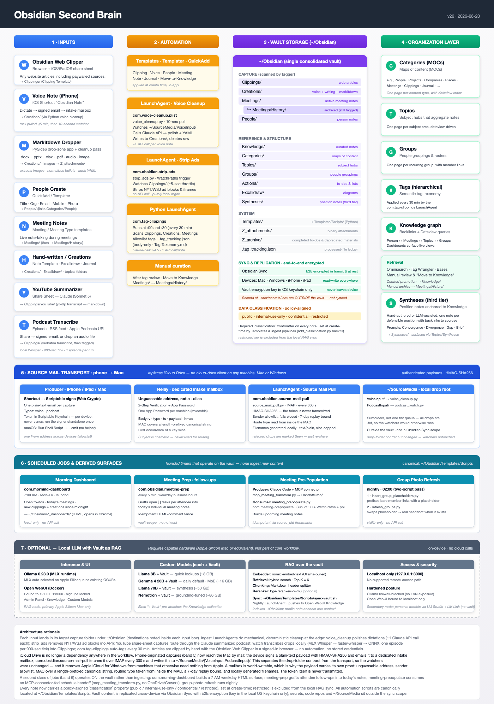

# Obsidian IT Leadership Vault Template

A customized Obsidian vault template designed for technology leaders who manage large teams, attend frequent meetings, and need to track people, groups, and projects effectively.



> A printable PDF version is at [`docs/second-brain-workflow.pdf`](docs/second-brain-workflow.pdf), and the editable source is [`docs/second-brain-workflow.svg`](docs/second-brain-workflow.svg).

## Built On

This template extends the [Kepano starter vault](https://github.com/kepano/obsidian-starter) with significant customizations for a leadership workflow.

## Key Features

- **Meeting Management** — Create meetings with a type selector (Group, Individual, Ad-hoc). Group meetings auto-populate attendees from roster files and link to the group. Meeting history appears on each person's and group's record via database views.
- **People Directory** — Contact records with photos, organizational info, and embedded meeting history via database views.
- **Groups with Photos** — Visual rosters with 40px thumbnail photos next to each member's name. Static groups for fixed rosters, dynamic Dataview groups for tag-based membership. A scheduled task refreshes group photos from People records.
- **Software Tracking** — Note template includes a Software type with fields for vendor, product, version, licensing, cost, and owner, plus specialized status options (Evaluating, Implementing, In Production, Retired).
- **Tag-Based Organization** — Single tagging system for all classification. Tags work in frontmatter and inline. Topics folder provides dynamic views built on tag combinations.
- **Task Tracking** — Inline tasks in any note, aggregated into open/completed views via the Tasks plugin.
- **Web Clipping** — **The primary way articles enter the vault.** The Obsidian Web Clipper saves any page you can read — including paywalled subscriptions, since it uses the session you're already signed in to — as a templated note in `Clippings/`, which the tagger then treats like any other clip. Works as a browser extension and as the iOS/iPadOS share sheet, so a clip made on an iPad arrives everywhere through Obsidian Sync. No automation, no stored credentials, nothing to permission. Includes batch filename cleanup for cross-platform compatibility.
- **Source Mail Transport** — How phone-originated captures reach the Mac, with no cloud-drive client on either platform. The device signs a plain-text payload with HMAC-SHA256 and emails it to a dedicated intake mailbox; `com.obsidian.source-mail-pull` fetches it over IMAP every 300 seconds and writes it into `~/SourceMedia/{VoiceInput,PodcastInput}/`, where the existing watchers pick it up unchanged. A mailbox is world-writable, so the payload carries its own proof: unguessable address, sender allowlist that fails closed, MAC over a length-prefixed canonical string, routing type read from inside the MAC, a 7-day replay bound, and locally generated filenames. The token itself is never transmitted. Component `39-source-mail` prompts for the mailbox credentials, generates the shared token, creates `~/SourceMedia/` and installs the agent; on Windows it is the `source-mail-pull` scheduled task, registered disabled. See [`docs/Source-Mail-Transport.md`](docs/Source-Mail-Transport.md).
- **Podcast Transcription (Optional)** — Transcribe an episode locally and file the result as a note. `podcast_transcribe.py` takes an episode URL, an RSS feed, an Apple Podcasts link, or a local audio file and writes a verbatim markdown transcript; backends are tried in order — MLX Whisper (Apple Silicon GPU), faster-whisper (CPU), then ONNX Runtime (torch-free, the only option on Windows ARM64). `podcast_watch.py` is the drop-folder front end: it drains `~/SourceMedia/PodcastInput/` into `Clippings/` so the tagger treats a transcript like any other clip. Throttled unlike the other watchers — transcription costs real CPU for real minutes, so it takes one episode per 900-second tick behind a single-instance lock, and processed drops are moved to `done/` or `failed/`, never deleted. Component `47-podcast` installs `ffmpeg`, the backend and the watcher LaunchAgent; on Windows it is the `podcast-watch` scheduled task.
- **Semantic Auto-Tagging** — A Python LaunchAgent (`com.tag-clippings.plist`) runs every 30 minutes, scans `Clippings/`, `Creations/`, and `Meetings/` for new or changed notes, sends each note's body to the Claude API, and applies 1–6 topical tags per note. Tags are only ever drawn from your existing taxonomy — never invented — and an optional `Knowledge/Tag Taxonomy.md` allowlist file locks the tag space down hard. Body-only derivation: tags are never inferred from frontmatter, filename, or attendee lists. See [`docs/Semantic Auto-Tagger Setup.md`](docs/Semantic%20Auto-Tagger%20Setup.md).
- **Voice Notes (Optional)** — A Python LaunchAgent (`com.voice-cleanup.plist`) polls `~/SourceMedia/VoiceInput/` every 10 seconds, polishes raw iPhone dictation through the Claude API, and drops the cleaned markdown into `Creations/` so the tagger picks it up on the next run. See [`docs/Voice Notes (Optional).md`](docs/Voice%20Notes%20%28Optional%29.md).
- **YouTube Summarizer (Optional)** — An on-demand CLI tool (`youtube_summarize.py`): pulls a video's captions via `yt-dlp`, summarizes the transcript through Claude, and writes a tagged note into `Clippings/YouTube/`. Single videos or whole playlists. Uses the same endpoint and credential as the auto-tagger, so it needs no key of its own. See [`docs/YouTube Summarizer.md`](docs/YouTube%20Summarizer.md).
- **Markitdown Dropper (Optional)** — A small always-on-top macOS app that converts dropped Word / Excel / PowerPoint / PDF / HTML / audio / image files into Markdown. Includes an inline cleanup pass that extracts embedded images to `Z_attachments/`, recovers images from source archives when Markitdown emits broken stubs, normalizes Outlook/Word bullet markers, promotes strict heading patterns, and adds frontmatter — so converted documents land in `Creations/` ready for the tagger and indexable by RAG. See [`docs/Markitdown Dropper.md`](docs/Markitdown%20Dropper.md).
- **Local LLM with Vault as RAG (Optional)** — On-device chat with your vault: Ollama for inference, Open WebUI for the UI plus the RAG layer, a Python sync script that pushes the vault into Open WebUI's Knowledge collection nightly, and Tailscale for tailnet access. All inference stays on your machine. Requires capable Apple Silicon hardware. See [`docs/Local LLM with Obsidian Vault RAG.md`](docs/Local%20LLM%20with%20Obsidian%20Vault%20RAG.md).
- **Meeting Pre-Population (Optional)** — A consumer LaunchAgent (`com.meeting-prepopulate`) that reads a weekly schedule-handoff JSON your producer drops into a local folder and turns it into Obsidian meeting notes and People stubs: attendee wikilinks, group/individual classification, recurring-series roots, and reschedule/cancel handling. Recommended producer: a Claude Code session with an MCP connector to your calendar system, feeding it directly with no relay needed — see [`docs/Meeting-Handoff-MCP-Producer.md`](docs/Meeting-Handoff-MCP-Producer.md) (a ready-to-use Microsoft 365 reference transform ships as `Templates/Scripts/mcp_meeting_transform.py`). Any other producer works too, fed directly or via a relay — see [`docs/Azure-Blob-Handoff-Relay.md`](docs/Azure-Blob-Handoff-Relay.md) for a worked Azure Blob Storage relay; the JSON contract is documented in [`docs/Meeting-Pre-Population.md`](docs/Meeting-Pre-Population.md). Both halves can run unattended: the producer ships as a weekday-morning job (`com.obsidian.meeting-pull`, component `54-meeting-pull`) that pulls the day's calendar through the connector, so notes are already written before you sit down. Off by default — enable with `./install.sh --only 52-meeting-prepopulate` and `--only 54-meeting-pull`.
- **Security Harness** — Three standard-library LaunchAgents watch the workflow's attack surface: community-plugin code integrity (against an HMAC-signed allowlist), integrity of the automation scripts and LaunchAgents plus a bulk-deletion guard on the vault, and an audit of processes Obsidian spawns (optional — skip it if this Mac already runs managed EDR like Microsoft Defender for Endpoint). Local, read-only, and daily; findings go to an alert log and macOS notifications. See [`docs/Security-Harness.md`](docs/Security-Harness.md).
- **Morning Dashboard** — A weekday LaunchAgent (`com.morning-dashboard`) that builds a single self-contained HTML page each morning: open to-dos across the vault, today's meetings, new clippings/creations since midnight, and live RAG-sync + pipeline health. Written to `Z_dashboards/` and opened in your browser, with every item linking back into the vault via `obsidian://` URIs. Runs Mon–Fri 07:00; its staleness check is weekend-aware so Mondays don't read as stale.
- **Vault Lint** — A weekly LaunchAgent (`com.obsidian.vault-lint`) that sweeps the vault for entropy rather than attack: duplicate and malformed tags, drift against your tag taxonomy, near-duplicate notes, frontmatter schema gaps, broken wikilinks, and vault scripts that have fallen behind this repo. That last check catches what hash-based integrity monitoring structurally cannot — a script pinned against *itself* looks healthy while running last month's logic. Read-only on its schedule; the fixers are opt-in, dry-run by default, and write a rollback manifest. See [`docs/Vault-Lint.md`](docs/Vault-Lint.md).

- **Data Classification** — A nightly LaunchAgent (`com.obsidian.classify`) that proposes a classification tier for notes whose body changed, and a companion export gate that refuses to ship content above the tier its audience is cleared for. Three layers: deterministic detectors auto-apply `restricted` for material that is regulated on sight (SSN, private key, API token, MRN with a value); a Haiku-class model adjudicates everything else against a topic-versus-instance rule, because a vault like this discusses HIPAA and breaches constantly as *subject matter* and keyword DLP alone measured ~80% false positive; and the model never writes `classification` itself — it proposes, and you accept in a review queue. Elevation only, never demotion. The export gate resolves `![[embeds]]` recursively, so a `public` note that transcludes a `confidential` one is correctly blocked. See [`docs/Data-Classification.md`](docs/Data-Classification.md).
- **Synthetic Demo Content** — The repo ships content-free, so one command fills the vault with an obviously-fictional dataset (Nimbus Widgets Inc., `.example` addresses, `555` numbers) and one command removes it. ~74 notes across every content folder — people, groups, meetings, clippings, a working tag taxonomy — so the Bases, Topics, graph view, and Morning Dashboard all show something real instead of empty folders. Generated rather than committed because the dashboard keys off today's date, and removal is guarded so it is safe to run in a vault holding your own notes. See [`docs/Demo-Content.md`](docs/Demo-Content.md).
- **Quick Actions** — Sidebar buttons for New Meeting, New Note, and New Person via QuickAdd + Commander.
- **Utility Templates** — Templater-based actions for moving files to the Knowledge folder and cleaning Windows-incompatible filenames.

## Before You Start — Have These Ready

The installer (`./install.sh`) will pause partway through to ask for API keys. Grabbing them now means an uninterrupted run:

- **Anthropic API key** — used by the auto-tagger, voice-cleanup, and RAG sync. Sign in at <https://console.anthropic.com/settings/keys> and create a key. *If your organization runs its own AI gateway, use a key from that instead — see [Install profiles](#install-profiles), which points every Claude call at the gateway so the traffic bills and is governed centrally rather than on your card.*
- **Your sudo password** — the security component installs a log-rotation config under `/etc/newsyslog.d/`. One prompt up front; cached for the rest of the run.
- **A dedicated intake mailbox** *(optional)* — only needed for the phone-originated pipelines (voice notes, podcasts). Create a throwaway account with an unguessable address, turn on 2-Step Verification, and generate an App Password before you start; component `39-source-mail` will prompt for both, and generates the shared signing token for you. See [`docs/Source-Mail-Transport.md`](docs/Source-Mail-Transport.md). No cloud-drive client is required on any machine.

You can skip any key prompt and store the value later with `python3 Templates/Scripts/secret_store.py set <NAME>`, but the affected agent won't work until you do.

## Quick Start

### macOS

Two commands on a fresh Mac:

```bash
git clone https://github.com/rm21-coder/obsidian-template ~/Obsidian
cd ~/Obsidian && ./install.sh
```

`install.sh` runs every component interactively (you confirm at each step). It will:

- Install Homebrew, python3.13, yt-dlp, ffmpeg, Ollama, Docker Desktop, and Obsidian.app — anything missing
- Bootstrap the vault folders and a per-vault Python venv with the workflow dependencies
- Prompt for API keys (Anthropic or your gateway, Open WebUI) — see [Before You Start](#before-you-start--have-these-ready) above
- Install the 13 community plugins from **pinned, SHA256-verified** GitHub releases into `.obsidian/plugins/` (pins live in `installers/plugin-pins.json`; refresh deliberately with `installers/lib/pin_plugins.py`)
- Install 13 LaunchAgents (tagger, voice-cleanup, source-mail-pull, strip-ads, podcast-watch, meeting-prep, two security agents, RAG sync, group-photos, morning-dashboard, vault-lint, nightly classifier) and build the Markitdown Dropper.app — the two meeting-pipeline agents are separate opt-ins
- Apply the canonical ribbon icon order to `workspace.json`
- Pull a local 8B LLM model via Ollama and start an Open WebUI container at <http://localhost:3000>
- Print a final 19-row status table

When it finishes, three one-time manual steps:

1. **Launch Obsidian** (Spotlight: ⌘-Space → "Obsidian"), open `~/Obsidian` as a vault, click **Trust author and enable plugins**, then quit and reopen so hotkeys bind correctly.
2. **Open WebUI setup at <http://localhost:3000>** — create an admin account, create a Knowledge collection named `Obsidian`, generate an API key in Settings → Account → API Keys, copy the collection UUID from the URL, then re-run `./install.sh --only 20-secrets --force` to wire both values into `~/dev/secrets/.env`.
3. **Establish the security baselines** (what each control does and how to respond to alerts: [`docs/Security-Harness.md`](docs/Security-Harness.md)):
   ```bash
   /usr/bin/python3 ~/Obsidian/Templates/Scripts/plugin_integrity_check.py --update
   /usr/bin/python3 ~/Obsidian/Templates/Scripts/integrity_monitor.py --update
   ```

### Common flags

```bash
./install.sh --auto              # non-interactive; sensible defaults at every prompt
./install.sh --profile gateway   # pre-answer the prompts from a profile (see below)
./install.sh --list-profiles     # print available profiles and exit
./install.sh --only 30-plugins   # re-run just one component
./install.sh --skip 47-podcast   # skip one component
./install.sh --without-llm       # skip the entire Ollama / Open WebUI / RAG stack
./install.sh --without-podcast   # skip the podcast-transcribe component
./install.sh --list              # print the component list and exit
./install.sh --rebaseline        # force security controls to re-baseline
./install.sh --force             # let secrets prompts overwrite existing values
```

### Install profiles

Three components ship **off** — meeting pre-population (52), the meeting-pull
producer (54), and the dashboard's action buttons (57) — and a few prompts
have no universal default. Not because they are unfinished, but because they
depend on things an installer cannot provision: an AI gateway with a key
issued to you, an MCP calendar connector your tenant has approved, the list
of domains that count as internal here.

That default is right for a stranger cloning this repo, and wrong for a
colleague inside the same organization who has all three and should end up
with the full setup rather than the reduced one. A profile is a small env file
that answers those prompts:

```bash
./install.sh --profile ours              # installers/profiles/ours.env
./install.sh --profile ~/ours.env        # a file someone handed you
./install.sh --auto --profile ours       # unattended; the profile is the consent
./install.sh --profile ours --dry-run    # what it would turn on, changes nothing
```

A profile carries two kinds of answer:

- **Where Claude calls go.** `LLM_BASE_URL` + `LLM_API_KEY_NAME` route every
  Claude-calling script through an institutional AI gateway instead of
  `api.anthropic.com`. The installer persists both to `~/dev/secrets/.env`,
  which is what the scheduled LaunchAgents read — they do not inherit your
  shell, so a gateway set only in your terminal would work at install time and
  quietly revert to stock auth at 03:00. The gateway has to speak the
  Anthropic Messages API; see
  [`Templates/Scripts/llm_endpoint.py`](Templates/Scripts/llm_endpoint.py).
  With nothing set, the default is stock Anthropic exactly as before.
- **Which opt-in components to run, and their answers** — tenant domains, MCP
  tool names, timezone, drop folder. In an interactive run these arrive as
  editable defaults, so anything can be overtyped.

Copy [`installers/profiles/gateway.env.example`](installers/profiles/gateway.env.example),
fill in your organization's values, and hand the file over with the repo URL.
Every key is documented in
[`installers/profiles/README.md`](installers/profiles/README.md).

Two cautions. A profile is *sourced*, so it is shell code at the same trust
level as `install.sh` — read one before running it, and only run profiles from
someone you trust. And profiles never contain a key: they name the secret, the
installer prompts for the value, and it lands in the Keychain.
`installers/profiles/*.env` is gitignored, because a real profile names
internal endpoints and tenant domains — fine to send a colleague, a
deliberate disclosure decision to publish.

### Windows

Three commands on a fresh Windows machine:

```powershell
git clone https://github.com/rm21-coder/obsidian-template.git $env:USERPROFILE\Obsidian
cd $env:USERPROFILE\Obsidian
powershell -ExecutionPolicy Bypass -File .\Templates\Scripts\windows\install.ps1
```

`install.ps1` is the PowerShell counterpart to `install.sh` — Windows Task
Scheduler in place of `launchd`, the same Python automation, and a fully
local RAG stack (Ollama + Open WebUI in Docker, no Mac required). Validated
end-to-end on Windows 11 (x64). Add `-WithRAG` for the optional local LLM
stack (the iPhone/iPad pipelines need nothing installed on Windows — they
arrive over the signed mail transport). Full quick start,
prerequisites, the scheduled-jobs list, and manual setup steps (API keys,
Open WebUI) are in [`docs/Windows Setup.md`](docs/Windows%20Setup.md).

### Underlying mechanics

The orchestrator + 28 component installers live under `installers/`. The original per-feature manual setup is preserved in the docs/ guides if you want to understand or override what the installer is doing:

- [`docs/Obsidian Configuration Guide.md`](docs/Obsidian%20Configuration%20Guide.md) — plugin settings, template details, troubleshooting
- [`docs/Semantic Auto-Tagger Setup.md`](docs/Semantic%20Auto-Tagger%20Setup.md) — design rules, taxonomy allowlist, on-demand prompts
- [`docs/LaunchAgents — Setup & Migration.md`](docs/LaunchAgents%20%E2%80%94%20Setup%20%26%20Migration.md) — host-side launchd install + post-migration restore
- [`docs/Source-Mail-Transport.md`](docs/Source-Mail-Transport.md) — the signed-email transport that feeds the phone pipelines, and why a mailbox needs authenticated payloads
- [`docs/Voice Notes (Optional).md`](docs/Voice%20Notes%20%28Optional%29.md) — iPhone-dictation cleanup pipeline
- [`docs/YouTube Summarizer.md`](docs/YouTube%20Summarizer.md) — on-demand video-to-note summarizer
- [`docs/Markitdown Dropper.md`](docs/Markitdown%20Dropper.md) — drag-drop converter
- [`docs/Local LLM with Obsidian Vault RAG.md`](docs/Local%20LLM%20with%20Obsidian%20Vault%20RAG.md) — Ollama + Open WebUI setup
- [`docs/Security-Harness.md`](docs/Security-Harness.md) — the security controls, their baselines, the EDR hand-off for process auditing, and how to respond to alerts
- [`docs/Vault-Lint.md`](docs/Vault-Lint.md) — the weekly content lint: the seven checks, what it deliberately ignores, and the fixers
- [`docs/Data-Classification.md`](docs/Data-Classification.md) — the classification assistant and export gate: the three layers, the topic-versus-instance rule, and why the first pass must run with Obsidian quit
- [`docs/Windows Setup.md`](docs/Windows%20Setup.md) — the full Windows guide: quick start, prerequisites, scheduled jobs, architecture, RAG setup, uninstall
- [`docs/Demo-Content.md`](docs/Demo-Content.md) — the synthetic dataset: what ships, how to seed the dated half, and how to remove all of it

## Uninstall

### macOS

To tear down what `install.sh` set up — handy when rebuilding test environments:

```bash
./uninstall.sh              # interactive; safe defaults
./uninstall.sh --yes        # non-interactive
./uninstall.sh --all --yes  # full teardown (also Docker, secrets, newsyslog, plugins, demo data)
./uninstall.sh --dry-run    # print what would happen, change nothing
./uninstall.sh --demo       # also delete the synthetic demo dataset
```

By default it unloads and removes the LaunchAgents, the wrapper apps, the agent logs, and regenerable scratch state (the per-vault `.venv`, `.locks`/`.state`/`.config`, `.tag_tracking.json`, and the security state dir). It never touches your vault notes, Obsidian.app, Homebrew packages, or Ollama models. The `--llm`, `--secrets`, `--newsyslog`, `--plugins`, and `--demo` flags (or `--all`) also remove those data-bearing or sudo-gated pieces. See `./uninstall.sh --help`.

`--demo` is the teardown for [the demo dataset](#demo-content-included) — it delegates to `seed_demo_content.py --remove-all`, so it deletes both the dated notes that script generates and the static demo notes the template ships, and only ever considers notes carrying a `demo_seed` marker. Pair it with `--dry-run` to list them first. Without this flag the demo notes survive an uninstall and sit alongside whatever you have written since.

### Windows

One line, no separate execution-policy step (same as install):

```powershell
powershell -ExecutionPolicy Bypass -File .\Templates\Scripts\windows\uninstall.ps1 -All -RemoveApps -PurgeModels -Yes
```

Already bypassing execution policy for the window? Call it directly:

```powershell
.\Templates\Scripts\windows\uninstall.ps1              # interactive; safe defaults
.\Templates\Scripts\windows\uninstall.ps1 -Yes          # non-interactive, safe defaults
.\Templates\Scripts\windows\uninstall.ps1 -All -RemoveApps -PurgeModels -Yes   # complete uninstall
.\Templates\Scripts\windows\uninstall.ps1 -DryRun       # print what would happen, change nothing
```

Same safe-by-default shape as `uninstall.sh`: removes the scheduled tasks, the venv, `%LOCALAPPDATA%` state, and the Send To shortcut by default, and only removes the `~\Obsidian` junction itself — never the repo underneath. Note `-All` alone doesn't remove apps or Ollama models — `-RemoveApps`/`-PurgeModels` are always separate switches for a genuinely complete teardown. See [`docs/Windows Setup.md`](docs/Windows%20Setup.md#uninstall) for the full flag list.

## Prerequisites

This repo supports both **macOS** and **Windows** — pick the platform section below.

**macOS, required:**

- **Apple Silicon Mac** with ≥16 GB unified memory — needed for the local LLM RAG layer (16 GB works for the 8B model; ≥64 GB recommended for mid-tier; ≥128 GB for 70B+)
- **Homebrew** — installed automatically by `install.sh` if missing
- **API keys** (collected during install): **Anthropic** (or your institutional gateway)

**macOS, optional:**

- **Docker Desktop** — installed automatically by `install.sh` if you keep the LLM RAG component in scope
- **Tailscale** — for HTTPS access to Open WebUI from other devices on your tailnet (not auto-installed; see [`docs/Local LLM with Obsidian Vault RAG.md`](docs/Local%20LLM%20with%20Obsidian%20Vault%20RAG.md))
- **Obsidian Sync subscription** — to replicate the vault end-to-end encrypted across iPhone / iPad / other Macs

**Windows, required:**

- **Windows 10/11 (x64)**
- **Python 3.10+** — installed automatically by `install.ps1` if missing
- **API keys** (collected after install, into `.env`): **Anthropic** (or your institutional gateway)

**Windows, optional:**

- **Docker Desktop** — installed automatically by `setup-rag.ps1` if you use `-WithRAG`
- **Nothing from Apple** — the phone pipelines arrive by mail (`source_mail_pull.py`), so Apple iCloud for Windows is not needed; `install.ps1` never installs or prompts for it

See [`docs/Windows Setup.md`](docs/Windows%20Setup.md) for the full Windows prerequisites and setup details.

## Semantic Auto-Tagging (How It Works)

A Python LaunchAgent runs `Templates/Scripts/tag_clippings.py` every 30 minutes against the vault. It calls the Claude API one note at a time using a key in `~/dev/secrets/.env` and writes the result back to YAML frontmatter.

1. **Scan.** The script walks `Clippings/`, `Creations/`, and `Meetings/` (recursively).
2. **Skip unchanged.** A `.tag_tracking.json` ledger keys files by relative path with a body-content hash, so unchanged bodies are skipped.
3. **Build the allowlist.** If `Knowledge/Tag Taxonomy.md` exists, that file is the canonical allowlist. If it doesn't exist, the script falls back to a vault scan for tags currently in use.
4. **Body-only derivation.** For each in-scope file, the script strips frontmatter and sends only the body text (capped at 4 000 characters) to Claude. Tags are never inferred from `people:`, `group:`, `type:`, the filename, or any other metadata. An empty-body guard skips notes with <50 chars of body content.
5. **Normalize and validate.** Claude returns 1–6 candidate tags. The script PascalCases them (with an acronym whitelist for `AI`, `GPU`, `AWS`, etc.), looks each up against the allowlist, and drops anything unknown into `Templates/Scripts/tag-promotion-candidates.md` for weekly review instead of writing it.
6. **Apply.** Validated tags are merged with preserved base tags (the `clippings` base on `Clippings/` files) and written back to YAML, preserving all other frontmatter keys.

Notes edited within the last two minutes are deferred to the next run, so the tagger never rewrites a file you're actively typing in (`TAG_RECENT_EDIT_GUARD_SECONDS`, default 120 seconds; set `0` to disable).

Install steps, the optional Tag Taxonomy.md format, and on-demand maintenance prompts live in [`docs/Semantic Auto-Tagger Setup.md`](docs/Semantic%20Auto-Tagger%20Setup.md). Host-side prerequisites and post-migration restoration are in [`docs/LaunchAgents — Setup & Migration.md`](docs/LaunchAgents%20%E2%80%94%20Setup%20%26%20Migration.md).

## Folder Structure

| Folder | Purpose |
|--------|---------|
| Actions | Task lists and to-do items |
| Categories | Category index files |
| Clippings | Web clippings saved via the Obsidian Web Clipper extension |
| Creations | Original content (articles, outlines, research) plus the destination for voice-note cleanups and Markitdown drops |
| Daily | Daily journal entries |
| Excalidraw | Excalidraw drawings |
| Groups | Meeting group rosters (static and dynamic) |
| Knowledge | Reference material and learning notes — the curated, permanent home for graduated notes |
| Meetings | Meeting notes (flat, date-prefixed). Move older notes to `Meetings/History/` after tag review to keep the active folder tidy; the tagger keeps seeing the moved notes because `History/` is a sub-folder of `Meetings/` |
| Notes | General notes scaffold — `Dashboards/`, `Experiments/`, `NotebookLM/` for source-grounded research collections |
| People | Contact records with metadata and photos |
| Templates | Note templates, Bases (database views), and the optional Python helper scripts under `Templates/Scripts/` |
| Topics | Dynamic Dataview pages aggregating content by tags |
| Z_archive | Completed to-do actions and other deprecated materials |
| Z_attachments | Images and embedded files (excluded from the RAG sync) |
| docs | Project documentation — setup guides, the workflow graphic, and the meeting pre-population contract |

## Required Community Plugins

All plugins are pre-configured and included:

- **Templater** — Dynamic templates with JavaScript
- **QuickAdd** — Custom note creation commands
- **Dataview** — Dynamic queries and lists
- **Tasks** — Task management across vault
- **Commander** — Sidebar icon customization
- **Omnisearch** — Enhanced search
- **Recent Files** — Recently opened files sidebar
- **Paste Image Rename** — Clean image naming
- **Tag Wrangler** — Tag rename/merge tools
- **Sort and Permute Lines** — Line sorting utility
- **Excalidraw** — Drawing and diagrams
- **Update Time on Edit** — Auto-maintains the modified timestamp in note frontmatter
- **Metadata Menu** — Structured frontmatter field definitions and editing

## Demo Content Included

The repo ships **content-free** — every content folder is empty on clone. One
command fills it with a synthetic dataset so the Bases, Topics pages, graph
view, and Morning Dashboard show something real:

```bash
python3 Templates/Scripts/seed_demo_content.py
```

Everyone in it is invented — the organization is **Nimbus Widgets Inc.**, emails
use the reserved `.example` TLD, phone numbers use `555`. About 74 notes: 19
People (a full IT leadership team, vendor contacts, article authors), 4 Groups
(two static rosters, two Dataview-driven), 5 Categories index notes, 4 Knowledge
notes including a working `Tag Taxonomy.md` allowlist, 4 Topics, 5 Clippings, 4
Creations, ~22 Meetings across four weeks with three recurring-series roots, 3
journal entries, and the aggregated to-do view.

It is generated rather than committed because the Morning Dashboard reads
`Meetings/<today>*.md` — a meeting note with a fixed date is correct for one day
and reads as an empty dashboard after that. Re-running is idempotent, so run it
again before recording anything.

When you are ready to use the vault for real:

```bash
python3 Templates/Scripts/seed_demo_content.py --remove
```

Removal only ever touches files carrying a `demo_seed:` frontmatter marker
inside a known content folder, so it is safe to run in a vault that already has
your own notes in it. Full details in [`docs/Demo-Content.md`](docs/Demo-Content.md).

## Bases (Database Views)

`Templates/Bases/` ships pre-built database views: `Attachments`, `Backlinks`, `Clippings`, `Everything`, `Map`, `Meetings`, `Notes`, `People`, `Posts`, `Ratings`, `Related`, and `Templates`. They are embedded into individual notes via `![[Meetings.base#Person]]`-style links — see the People and Meeting templates for examples.

## Templates/Scripts/ — Helper Scripts

`Templates/Scripts/` contains optional Python helpers and configuration:

- `tag_clippings.py` — semantic auto-tagger. Run as a `launchd` agent every 30 minutes via `com.tag-clippings.plist`. Reads `Knowledge/Tag Taxonomy.md` as a hard allowlist when present; falls back to a vault scan otherwise. Logs unknown candidates to `Templates/Scripts/tag-promotion-candidates.md`. Full install in `docs/LaunchAgents — Setup & Migration.md`.
- `voice_cleanup.py` — Watches `~/SourceMedia/VoiceInput/` for raw dictation `.txt` files and writes polished markdown into `Creations/`. **This is the active path** for the voice-notes pipeline; see `docs/Voice Notes (Optional).md`.
- `source_mail_pull.py` — Pulls signed capture drops out of a dedicated intake mailbox over IMAP and writes them into `~/SourceMedia/{VoiceInput,PodcastInput}/`, which is what removed the iCloud Drive dependency from the phone pipelines. Verifies an HMAC-SHA256 over a length-prefixed canonical string, checks the sender allowlist, bounds replay to 7 days, and generates its own filenames. `--emit` prints a correctly signed body and `--once --dry-run` verifies without writing — use both before wiring up a phone. Installed by component `39-source-mail`; runs every 300 seconds via `com.obsidian.source-mail-pull.plist` (macOS) or the `source-mail-pull` scheduled task (Windows). See `docs/Source-Mail-Transport.md`.
- `podcast_transcribe.py` — On-demand CLI (not scheduled): transcribes an episode URL, RSS feed, Apple Podcasts link, or local audio file to a verbatim markdown transcript, trying MLX Whisper, then faster-whisper, then ONNX Runtime. Installed by component `47-podcast` (Apple Silicon; requires `ffmpeg`).
- `podcast_watch.py` — Drop-folder front end for the above: drains `~/SourceMedia/PodcastInput/` (audio files or link files) into `Clippings/` so the tagger picks transcripts up like any other clip. One episode per run behind a single-instance lock, on a 900-second tick via `com.obsidian.podcast-watch.plist` (installed by component `47-podcast`); processed drops move to `done/` or `failed/` rather than being deleted.
- `youtube_summarize.py` — On-demand CLI (not scheduled): pulls a YouTube video's captions via `yt-dlp`, summarizes the transcript through Claude via `llm_endpoint.py`, and writes a tagged note into `Clippings/YouTube/`. Single video or `--playlist`. Defaults to `claude-sonnet-5`; override with `YOUTUBE_MODEL` or `--model`. Metered in `usage_log` like every other model call. See `docs/YouTube Summarizer.md`.
- `obsidian-rag-sync.py` — Pushes the vault into an Open WebUI Knowledge collection nightly so a local Ollama-backed model can use the vault as a RAG source. Optional; only relevant alongside the local LLM stack. See `docs/Local LLM with Obsidian Vault RAG.md` and `docs/LaunchAgents — Setup & Migration.md`.
- `markitdown_cleanup.py` — Post-conversion cleanup module imported by the Markitdown Dropper. See `docs/Markitdown Dropper.md`. Can also be run standalone for retroactive cleanup of existing files.
- `Z_attachments/insert_group_placeholders.py` + `Z_attachments/refresh_groups.py` — the Group photo refresh pair (these two live in `Z_attachments/`, not here). Run nightly in order by `com.obsidian.group-photos.plist`: the first prepends `![[placeholder-person.png|40]]` to any bare `[[Last, First]]` member row in `Groups/*.md`, the second swaps a placeholder for the real headshot once a matching `LastName-FirstName.{png,jpg,jpeg,webp}` exists in `Z_attachments/`. Both are stdlib-only and strictly conservative — they only ever add a placeholder or upgrade one, never modify or downgrade an existing photo reference. Add a new member as a plain `[[Last, First]]` line and the pipeline wires up the photo automatically.
- `meeting_prepopulate.py` — **(Optional)** consumer for the meeting pre-population pipeline: reads schedule-handoff JSON from a local drop folder (fed directly, or via a relay) and writes meeting notes + People stubs. Config is env-driven (`MEETING_PREPOP_HANDOFF_DIR`, `MEETING_PREPOP_VAULT`, …). Installed opt-in by component `52-meeting-prepopulate`. Full setup and the JSON handoff contract: [`docs/Meeting-Pre-Population.md`](docs/Meeting-Pre-Population.md); a worked Azure Blob Storage relay is in [`docs/Azure-Blob-Handoff-Relay.md`](docs/Azure-Blob-Handoff-Relay.md). The producer (which generates the handoff) is yours to build — recommended: a Claude Code session with an MCP connector, see [`docs/Meeting-Handoff-MCP-Producer.md`](docs/Meeting-Handoff-MCP-Producer.md); otherwise its deterministic reference transform is `Templates/Scripts/meeting_handoff_transform.js`.
- `mcp_meeting_transform.py` — **(Optional)** the recommended producer-side transform for meeting pre-population: turns raw calendar events fetched via an MCP connector (Microsoft 365 by default) into the schema-v1 handoff trio the consumer above already watches for. Run it from a Claude Code session with that connector active — no relay or custom server needed. See [`docs/Meeting-Handoff-MCP-Producer.md`](docs/Meeting-Handoff-MCP-Producer.md).
- `meeting_pull.py` — **(Optional)** the scheduled producer: runs `claude -p` headlessly against an MCP calendar connector — or, with `"producer": "graph"` in its config, calls Microsoft Graph directly via `graph_calendar_fetch.py` (zero LLM tokens, no Claude CLI dependency; one-time `--auth` sign-in) — then hands the result to `mcp_meeting_transform.py` so a handoff lands in the consumer's drop folder without anyone asking for it. Stdlib-only and cross-platform; identity and connector tool names come from `.config/meeting_pull.json` (gitignored). Installed opt-in by component `54-meeting-pull` and scheduled weekdays 05:00 by `com.obsidian.meeting-pull.plist`, with catch-up firings at 06:30 and 08:00 (`--skip-if-fresh` makes them no-ops once the day's handoff exists) so a laptop that slept through 05:00 still gets its notes. Validate with `--dry-run` first. See [`docs/Meeting-Handoff-MCP-Producer.md`](docs/Meeting-Handoff-MCP-Producer.md).
- `morning_dashboard.py` — builds the weekday morning HTML dashboard (open to-dos, today's meetings, new notes, RAG-sync + pipeline health + 7-day LLM usage) into `Z_dashboards/`. Run by `com.morning-dashboard` Mon–Fri 07:00; pass `--no-open` to skip launching Chrome. Defaults to `~/Obsidian`; set `OBSIDIAN_VAULT` to run it against a different vault (e.g. this repo, to see it populated with the demo data). Optional action buttons (pull meetings, rebaseline, refresh) render when the `obsidian-dashboard://` handler is installed — see [`docs/Dashboard-Actions.md`](docs/Dashboard-Actions.md) (component `57-dashboard-actions`, macOS only).
- `vault_lint.py` — **(Optional)** weekly content lint: duplicate/malformed tags, taxonomy drift, near-duplicate notes, frontmatter schema gaps, broken wikilinks, and vault-vs-repo script drift. Stdlib-only and dry-run by default; `--apply`, `--fix-malformed`, and `--fix-links` each write a rollback manifest. Installed by component `55-vault-lint` and scheduled Mondays 07:00 (read-only) by `com.obsidian.vault-lint.plist`. Set `VAULT_LINT_REPO` if your clone of this repo isn't at `~/dev/repos/obsidian-template`. See [`docs/Vault-Lint.md`](docs/Vault-Lint.md).
- `classify_notes.py` — **(Optional)** data-classification assistant. Deterministic detectors auto-apply `restricted`; a Haiku-class model *proposes* every other tier into `classification_suggested` for human review and never writes `classification` itself. Elevation only. Frontmatter is spliced rather than round-tripped, and the tracking hash covers the note body only so Obsidian's own frontmatter reserialisation cannot trigger an endless rewrite loop. `--detectors-only` needs no API key. Installed by component `58-classification`, scheduled 02:15 by `com.obsidian.classify.plist`. **Run the first full pass with Obsidian quit** — see [`docs/Data-Classification.md`](docs/Data-Classification.md).
- `disclosure_check.py` — **(Optional)** disclosure-aware export gate, and the consumer that makes classification labels load-bearing. Checks notes against an audience ceiling (`public` / `internal` / `cleared`); `restricted` is never exportable and `--override` will not lift that. Resolves `![[embeds]]` recursively, so exporting a note discloses everything it transcludes and is judged accordingly — the gap the per-file `02-classification-audit` cannot see. Fails closed on unlabeled notes, audits every decision and override. Exit codes `0`/`1`/`2` so it composes into other scripts. See [`docs/Data-Classification.md`](docs/Data-Classification.md).
- `seed_demo_content.py` — writes the entire synthetic demo dataset (people, groups, meetings, clippings, knowledge, topics) anchored to the day you run it, and removes it again with `--remove`. Stdlib-only, idempotent, and safe to run in a vault holding real notes — it only ever deletes files carrying a `demo_seed:` frontmatter marker inside a known content folder. See [`docs/Demo-Content.md`](docs/Demo-Content.md).
- `com.*.plist` (15 files) — the `launchd` agents for every scheduled job above (replace `YOUR_USERNAME` before installing by hand; the installer does it for you). See `docs/LaunchAgents — Setup & Migration.md` for prerequisites, install order, and post-migration restoration steps.
- `llm_endpoint.py` — the one place that decides *where* Claude calls go and *which* stored secret opens the door. Default is stock Anthropic with `ANTHROPIC_API_KEY`; setting `LLM_BASE_URL` and `LLM_API_KEY_NAME` in `~/dev/secrets/.env` moves every Claude-calling script onto an institutional AI gateway with no edit at any call site (the gateway must speak the Anthropic Messages API). `python3 llm_endpoint.py` prints the resolved endpoint without making a call — worth running when you want to confirm the scheduled agents really are going through the gateway — and reports on stderr whether that endpoint's hostname resolves. A configured gateway is preflighted before every call, so an internal endpoint reached only over a VPN fails with its hostname named and the VPN suggested, rather than the SDK's bare `Connection error.`; set `LLM_SKIP_PREFLIGHT=1` to opt out (proxied egress opts out on its own). Usually set for you by an install profile; see [Install profiles](#install-profiles).
- `requirements.txt` — core: `anthropic`, `pyyaml`, `python-dotenv`, `requests`; plus the optional feature stack (`yt-dlp`, `markitdown`, and the platform-guarded Whisper transcription backends)
- `voice_cleanup_config.yaml.example` — copy to `voice_cleanup_config.yaml` and edit

The scripts that call Claude expect an Anthropic API key in `~/dev/secrets/.env` (`ANTHROPIC_API_KEY=...`) — or, on an institutional AI gateway, `LLM_BASE_URL` plus `LLM_API_KEY_NAME` naming whichever secret holds the gateway key (`llm_endpoint.py` above); `obsidian-rag-sync.py` additionally expects `OPEN_WEBUI_API_KEY` and `OBSIDIAN_COLLECTION_ID` in the same file. Edit the `load_dotenv()` path in each script if your secrets live elsewhere. LaunchAgent logs go to `~/Library/Logs/{tag-clippings,voice-cleanup,obsidian-rag-sync,group-photos}.{log,err}`; create that directory (`mkdir -p ~/Library/Logs`) before loading any agent. The group-photos pair is stdlib-only and needs no API key.

## Customization

- `docs/Obsidian Configuration Guide.md` — plugin settings, template details, import procedures, troubleshooting
- `docs/Semantic Auto-Tagger Setup.md` — scheduled tagging task, on-demand maintenance prompts
- `docs/LaunchAgents — Setup & Migration.md` — host-side `launchd` install for the tagger and voice-cleanup, plus the post-migration restoration checklist (LaunchAgents do **not** survive a Migration Assistant transfer)
- `docs/Voice Notes (Optional).md` — voice cleanup pipeline (Python LaunchAgent)
- `docs/YouTube Summarizer.md` — on-demand video-to-note summarizer
- `docs/Markitdown Dropper.md` — drag-drop converter for Word / PDF / Excel / etc., with inline cleanup
- `docs/Local LLM with Obsidian Vault RAG.md` — on-device Ollama + Open WebUI setup using the vault as a RAG source
- `docs/Security-Harness.md` — the plugin / script / process integrity monitors, baselines, and alert response
